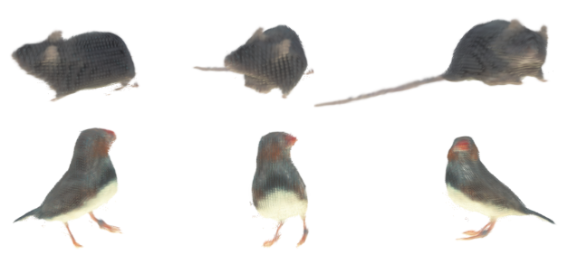

## Pose Splatter: A 3D Gaussian Splatting Model for Quantifying Animal Pose and Appearance [NeurIPS 2025]
[](https://arxiv.org/pdf/2505.18342.pdf) 

- Authors: [Jack Goffinet*](https://scholar.google.com/citations?user=-oXW2RYAAAAJ&hl=en),  [Youngjo Min*](https://sites.google.com/view/youngjo-min),  [Carlo Tomasi](https://users.cs.duke.edu/~tomasi/), [David Carlson](https://carlson.pratt.duke.edu/) (* denotes equal contribution)
<div align="center">



</div>


Code for "Pose Splatter: A 3D Gaussian Splatting Model for Quantifying Animal Pose and Appearance" (Goffinet, Min, Tomasi, & Carlson 2025). [arXiv](https://arxiv.org/abs/2505.18342)


### Usage Steps

1. **Collect up direction:**
    ```bash
    python estimate_up_direction.py config.json
    ```

2. **Get center and rotations:**
    ```bash
    python calculate_center_rotation.py config.json
    ```

3. **Get volume sum, decide volume_idx:**
    ```bash
    python calculate_crop_indices.py config.json
    ```

4. **Write images in HDF5 format:**
    ```bash
    python write_images.py config.json
    ```

5. **Copy images to ZARR for training:**
    ```bash
    python copy_to_zarr.py path/to/input.h5 path/to/output.zarr
    ```

6. **Train a model:**
    ```bash
    python train_script.py config.json
    ```

7. **Evaluate model:**
    ```bash
    python evaluate_model.py config.json
    ```

8. **Render an image:**
    ```bash
    python render_image.py config.json
    ```

9. **Calculate visual features:**
    ```bash
    python calculate_visual_features.py config.json
    ```

10. **Calculate visual embedding:**
    ```bash
    python calculate_visual_embedding.py config.json
    ```

### Project Checklist
- [x] Code on GitHub
- [ ] Camera-ready on arXiv
- [ ] Add links to data
- [ ] Add more detailed usage
